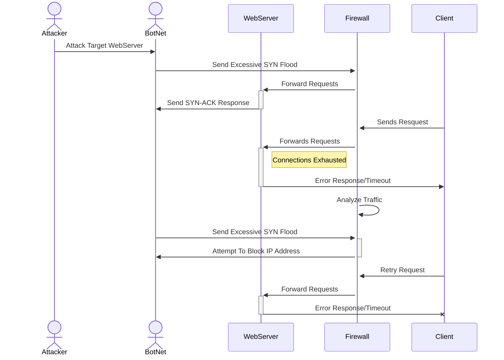

## DDoS Attack Sequence

```mermaid
sequenceDiagram
Actor Attacker
Actor BotNet
participant WebServer
participant Firewall

  Attacker->>BotNet: Attack Target WebServer
  BotNet->>+Firewall: Send Excessive SYN Flood
  Firewall->>+WebServer: Forward Requests
  WebServer->>-BotNet: Send SYN-ACK Response
  Client->>Firewall: Sends Resquest
  Firewall->>+WebServer: Forwards Requests
  note right of WebServer: Connections Exhausted
  WebServer->>-Client: Error Response/Timeout
  Firewall->>Firewall: Analyze Traffic
  BotNet->>+Firewall: Send Excessive SYN Flood
  Firewall->>-BotNet: Attempt To Block IP Address
  Client->>Firewall: Retry Request
  Firewall->>+WebServer: Forward Requests
  WebServer-x-Client: Error Response/Timeout
  
``` 
