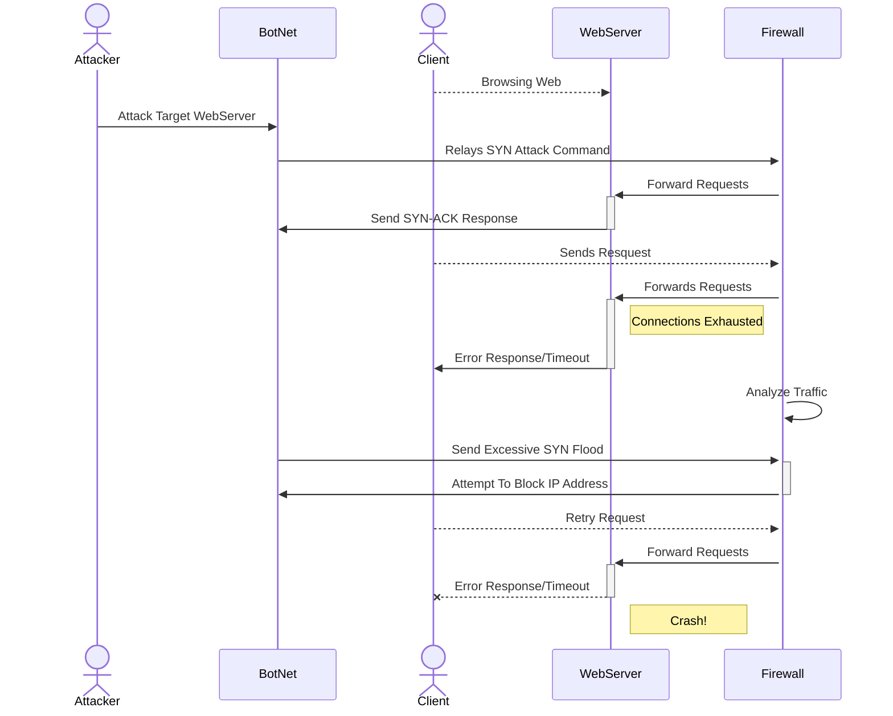

## DDoS Attack Sequence

## Explanation of the **DDoS Attack Sequence**

1. An attacker sends a large amount of **SYN** requests to a server
2. The server then receives the requests and sends out out an **SYN-ACK** response
3. The client is unable to send the request needed to complete the handshakes
4. The webserver populates a Connections Exhausted message
5. The webserver shows a **Error Response/Timeout** on screen
6. The Firewall is still analyzing the excessive incoming traffic coming through
7. Botnet sends out yet another **SYN** Flood
8. Firewall attempts to block the IP Address of the Attacker but is unable to do so
9. The client then retries the request
10. Firewall attemps to forward the requests
11. Webserver sends out another **Error Response/Timeout**
12. This is a severe attack and corrupts the symstem. The server will eventually be unable to accept new connections due to capacity. This may lead to devices crashing, timing out, or another malfunction along the way. 
